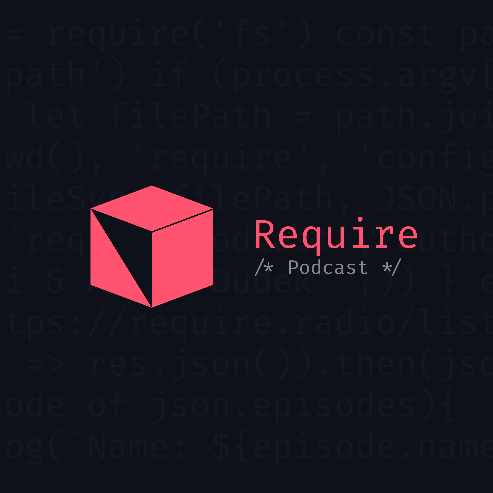

<h2 align="center">Require Podcast App</h2>

<i>Oficjalna aplikacja Require Podcast</i>

### O co chodzi?

Stworzyliśmy oficjalną apkiację do naszego podcastu - służy ona do słuchania odcinków, posiada integrację z archiwum (linki, itp.) oraz w przyszłości będzie wysyłać powiadomienia na temat nowych odcinków.

### Jak pobrać?

Jak na razie aplikacja jest w fazie `Beta`, więc jedyna opcja instalacji, to pobranie pakietu `.apk`, z zakładki [releases]('https://github.com/requirepodcast/app/releases'). Planujemy stworzenie osobnej strony, z której będzie można ją pobrać, a w niedalekiej przyszłości postaramy się umieścić ją w Sklepie Play.

Niestety, na urządzenia z iOS nie istnieje możliwość pobrania aplikacji - koszty opublikowania takowej w App Store sa zbyt duże.

### Jak to jest zrobione?

W celu stworzenia tej apki, użyliśmy Reacta Native. Dodatkowo wykorzystaliśmy:

- [Redux](https://redux.js.org/) i [Redux Saga](https://redux-saga.js.org/), w celu zarządzania stanem aplikacji (odtwarzacz podcastu, pobieranie odcinków)
- [React Navigation](https://reactnavigation.org/) - nawigacja wewnątrz aplikacji
- [react-native-markdown-view](https://github.com/Benjamin-Dobell/react-native-markdown-view) - parsowanie wpisów z archiwum (z markdowna, na komponenty RN)
- [react-native-video](https://github.com/react-native-community/react-native-video) - odtwarzacz audio
- [react-native-music-control](https://github.com/tanguyantoine/react-native-music-control) - Systemowe odtwarzacze audio (w centrum powiadomień, na zablokowanym ekranie, itp.)

### Kontrybucje

Masz pomysł jak ulepszyć naszą aplikację? Chcesz nam pomóc w jej rozwoju? Sprawdź informacje w pliku [contributions.md](contributions.md)

### Screenshoty

**Po więcej newsów, śledźcie nas na [Instagramie](https://instagram.com/requirepodcast), a wolnym czasie wpadnijcie na naszego [Discorda](https://require.podcast.gq/discord)**
